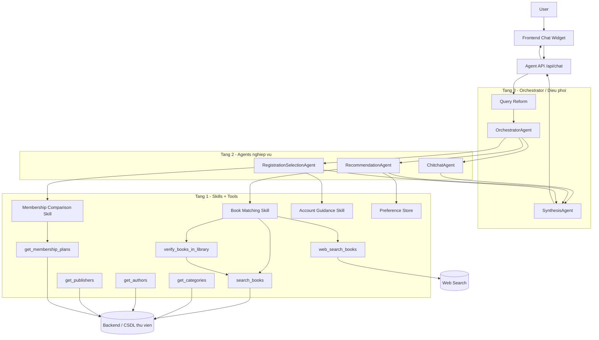

# Multi-Agent Library Assistant - 3 Layers

Rang buoc an toan:
- Sach cho phep chon/them gio phai co `_id` trong CSDL thu vien.
- Neu thu vien khong co tac pham, agent noi ro khong co va goi y sach lien quan trong CSDL neu tim duoc.
- Agent chi doc danh sach goi hoi vien, khong tu dang ky va khong tu thanh toan.
