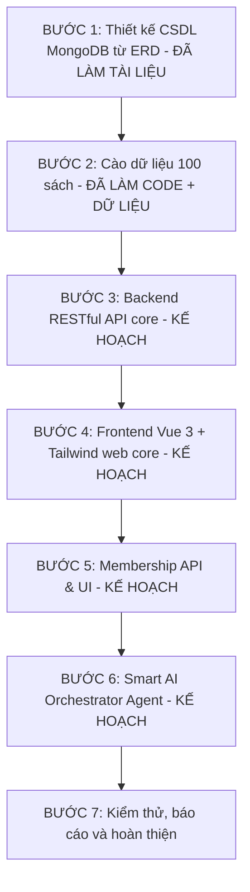

<!--
Chức năng: Hướng dẫn kế hoạch phát triển cập nhật cho Hệ thống Mượn Sách Online.
Lý do cập nhật: Đồng bộ với tài liệu trong document/, report/ và trạng thái code thực tế (chưa có code Backend, Frontend, hay Agent, chỉ mới có bộ scripts cào và dữ liệu cào mẫu).
Link trích dẫn tham khảo: https://www.fahasa.com/?utm_source=chatgpt.com
-->

# Hướng Dẫn Phát Triển - Hệ Thống Mượn Sách Online

Tài liệu này là kế hoạch phát triển hiện tại cho dự án **Hệ thống Mượn Sách Online (Book Borrowing System)** bằng Vue 3, Tailwind CSS, Node.js (Express) và MongoDB.

Kế hoạch đã được điều chỉnh dựa trên:
- `document/Quanlymuonsach.pdf`: yêu cầu nghiệp vụ gốc về độc giả, sách, nhà xuất bản, theo dõi mượn sách và nhân viên.
- `document/database_schema.md`: thiết kế MongoDB/Mongoose 12 collections, auto-generated code, soft delete và drain strategy.
- `document/scrape_books_guide.md`: hướng dẫn tool cào dữ liệu sách.
- `report/feature_auto_generate_code_schema.md`: báo cáo chuẩn hóa mã tự động.
- `report/feature_scrape_books.md`: báo cáo tool cào dữ liệu sách.
- `backend/src/scripts/`: bộ mã nguồn crawler đã triển khai.

---

## 1. Trạng Thái Hiện Tại

| Hạng mục | Trạng thái | Căn cứ |
| :--- | :--- | :--- |
| Phân tích ERD/yêu cầu CSDL gốc | `[ĐÃ LÀM - TÀI LIỆU]` | `document/Quanlymuonsach.pdf`, `document/erd.cdm` |
| Thiết kế CSDL MongoDB 12 collections | `[ĐÃ LÀM - TÀI LIỆU]` | `document/database_schema.md` |
| Quy chuẩn sinh mã tự động cho 12 collections | `[ĐÃ LÀM - TÀI LIỆU]` | `document/database_schema.md`, `report/feature_auto_generate_code_schema.md` |
| Soft delete và drain strategy khi ngừng phục vụ đầu sách | `[ĐÃ LÀM - CODE]` | `book.service.js → softDeleteBookTitle()` |
| Tool cào dữ liệu sách | `[ĐÃ LÀM - CODE]` | `backend/src/scripts/scrapeBooks.js` và `backend/src/scripts/scrapers/` |
| Dữ liệu scrape 100 sách demo | `[ĐÃ LÀM - DỮ LIỆU]` | `backend/src/scripts/output/scraped_books.json`, `scrape_stats.json` |
| Script Seeding dữ liệu mẫu | `[ĐÃ LÀM - CODE]` | `backend/src/scripts/seedFromScrapedBooks.js` |
| Backend RESTful API | `[ĐÃ LÀM - CODE]` | 5 modules (users, books, borrowing, memberships, discounts), 40+ endpoints, 18/18 test pass |
| Frontend Vue 3 + Tailwind | `[CHƯA LÀM - KẾ HOẠCH]` | Chưa khởi tạo dự án frontend |
| Membership API/UI | `[ĐÃ LÀM - API]` | API đầy đủ: CRUD gói, đăng ký, xem subscription. UI chưa làm |
| Smart AI Orchestrator Agent | `[CHƯA LÀM - KẾ HOẠCH]` | Chưa triển khai |
| Báo cáo tính năng | `[ĐANG THỰC HIỆN]` | 14 báo cáo trong `report/` |

Checklist tổng quan:

- [x] Phân tích yêu cầu nghiệp vụ gốc về quản lý mượn sách.
- [x] Thiết kế CSDL MongoDB mở rộng từ ERD gốc.
- [x] Chuẩn hóa mã tự động cho các collection chính.
- [x] Tài liệu hóa soft delete/drain strategy cho đầu sách đang được mượn.
- [x] Xây dựng tool cào dữ liệu sách từ Fahasa và Nhà sách Phương Nam.
- [x] Cào đủ 100 sách demo và lưu output JSON.
- [x] Viết mã nguồn script seed dữ liệu từ file JSON cào được.
- [x] Xây dựng backend RESTful API core theo kiến trúc modular.
- [ ] Triển khai frontend Public Website và Admin Portal bằng Vue 3 + Tailwind CSS.
- [x] Triển khai membership package API.
- [ ] Triển khai Smart AI Orchestrator Agent API & UI widget.

---

## 2. Lộ Trình Phát Triển Cập Nhật



---

## 3. Nguyên Tắc Phát Triển

1. **Tách module rõ ràng**: Backend, frontend, agent, document và report phải tách riêng.
2. **Không dồn code vào một file**: Mỗi domain nghiệp vụ cần có model, controller/service, route riêng.
3. **Bám schema đã thiết kế**: Backend phải triển khai theo 12 collections trong `document/database_schema.md`.
4. **Sinh mã tự động**: Người dùng/nhân viên không nhập thủ công các mã như `DG00001`, `PM000001`, `DS00001`.
5. **An toàn tồn kho**: Mượn/trả sách phải xử lý cạnh tranh bằng transaction hoặc cơ chế khóa phù hợp.
6. **Báo cáo sau mỗi tính năng**: Mỗi tính năng hoàn thành phải có `report/feature_<ten_tinh_nang>.md`.
7. **Agent tách rõ Agent - Skill - Tool**: Orchestrator chỉ điều phối, không tự xử lý toàn bộ nghiệp vụ.

### 3.1. Quy Ước Bắt Buộc Về Ràng Buộc Và Trigger Backend

Các bước phát triển backend sau này phải tuân thủ các quy ước sau để không làm sai lệch ràng buộc/trigger hiện có:

1. **Không bypass Mongoose hook nghiệp vụ**: Không dùng trực tiếp `findByIdAndUpdate()`, `updateOne()`, `updateMany()`, `insertMany()` hoặc `deleteMany()` cho các nghiệp vụ có trigger nếu chưa có service kiểm soát riêng.
2. **Ưu tiên service nghiệp vụ**: Luồng mượn/trả/hủy phiếu/ngừng phục vụ/xóa mềm đầu sách/thêm bản sao sách phải đi qua service trong `backend/src/services/`, không cập nhật model trực tiếp từ controller.
3. **Mượn sách phải khóa bản sao vật lý**: Chỉ được mượn `BookCopy.tinhTrang = 'CHO_MUON'` và `isDeleted = false`; khi mượn thành công phải đổi sang `DA_MUON` bằng điều kiện atomically để tránh 2 người mượn cùng một cuốn.
4. **Trả sách phải giải phóng đúng trạng thái**: Nếu đầu sách còn `ACTIVE` và chưa xóa thì bản sao quay về `CHO_MUON`; nếu đầu sách `DISCONTINUED` hoặc `isDeleted = true` thì bản sao chuyển sang `BAO_TRI` và bị xóa mềm.
5. **Không xóa mềm đầu sách khi còn sách đang mượn**: `BookTitle.isDeleted = true` phải bị chặn nếu còn `BookCopy.tinhTrang = 'DA_MUON'` và `isDeleted = false`.
6. **Ngừng phục vụ dùng drain strategy**: `BookTitle.trangThai = 'DISCONTINUED'` vẫn được phép khi còn sách đang mượn; sách rảnh bị thu hồi ngay, sách đang mượn sẽ bị thu hồi khi trả.
7. **Không hủy phiếu sau khi đã giao sách**: Trạng thái `HUY` chỉ dùng cho phiếu chưa phát sinh sách đang mượn; phiếu đã giao sách phải kết thúc bằng luồng trả sách `DA_TRA`.
8. **Trả từng cuốn được hỗ trợ**: `BorrowReceipt.chiTietMuon[].daTraChua` là trạng thái theo từng cuốn; chỉ khi tất cả sách đã trả thì phiếu mới chuyển sang `DA_TRA`.
9. **Phiếu quá hạn cần job riêng**: Hàm/script cập nhật `DANG_MUON` sang `QUA_HAN` phải được gọi định kỳ, ví dụ bằng `npm run mark-overdue` hoặc scheduler khi deploy.
10. **Độc giả mượn sách phải hợp lệ**: Chỉ cho mượn nếu `Reader.trangThai = 'ACTIVE'`, `isDeleted = false`, có `Subscription.trangThai = 'DANG_HIEU_LUC'`, còn hạn, không vượt `soSachToiDa`, không vượt `soNgayMuonToiDa`, và không còn phiếu phạt chưa thanh toán.
11. **Ràng buộc số lượng phải giữ đúng ý nghĩa**: `BookTitle.tongSoLuong` là tổng bản sao từng nhập; `soLuongDangQuanLy` là số bản sao chưa xóa mềm; `soLuongKhaDung` là số bản sao có thể cho mượn.
12. **Ràng buộc tham chiếu phải được kiểm tra**: Các ref chính như `Reader`, `Staff`, `BookTitle`, `BookCopy`, `Author`, `Publisher`, `Category`, `MembershipPlan`, `BorrowReceipt` phải kiểm tra tồn tại ở model/service; không chỉ dựa vào ObjectId hợp lệ.
13. **Mật khẩu không lưu plain text**: `Reader` và `Staff` phải hash mật khẩu bằng cơ chế có salt; không quay lại SHA256 tĩnh.
14. **Mã giảm giá phải dùng atomically**: Khi áp dụng `DiscountCode`, phải kiểm tra còn hạn, đơn tối thiểu, `soLuotDaDung < soLuongMaToiDa`, và tăng lượt dùng bằng update nguyên tử.
15. **Test sau khi chỉnh ràng buộc/trigger**: Mọi thay đổi vào model/service nghiệp vụ phải chạy `cd backend && npm test`; nếu thêm service mới, cần bổ sung test tương ứng khi có thời gian.

---

## 4. Chi Tiết Các Bước Thực Hiện

### Bước 1: Thiết Kế CSDL MongoDB Từ ERD

Trạng thái: `[ĐÃ LÀM - TÀI LIỆU]`

Đã có:
- `document/database_schema.md`
- `report/feature_auto_generate_code_schema.md`

Mô hình CSDL hiện tại gồm 12 collections:

| Collection | Model | Mã tự động | Trạng thái |
| :--- | :--- | :--- | :--- |
| `publishers` | `Publisher` | `NXB001` | `[ĐÃ THIẾT KẾ]` |
| `authors` | `Author` | `TG0001` | `[ĐÃ THIẾT KẾ]` |
| `categories` | `Category` | `TL001` | `[ĐÃ THIẾT KẾ]` |
| `book_titles` | `BookTitle` | `DS00001` | `[ĐÃ THIẾT KẾ]` |
| `book_copies` | `BookCopy` | `BS000001` | `[ĐÃ THIẾT KẾ]` |
| `readers` | `Reader` | `DG00001` | `[ĐÃ THIẾT KẾ]` |
| `staffs` | `Staff` | `NV001` | `[ĐÃ THIẾT KẾ]` |
| `membership_plans` | `MembershipPlan` | `GOI001` | `[ĐÃ THIẾT KẾ]` |
| `subscriptions` | `Subscription` | `DK000001` | `[ĐÃ THIẾT KẾ]` |
| `borrow_receipts` | `BorrowReceipt` | `PM000001` | `[ĐÃ THIẾT KẾ]` |
| `penalty_tickets` | `PenaltyTicket` | `PP000001` | `[ĐÃ THIẾT KẾ]` |
| `discount_codes` | `DiscountCode` | `KM202607001` | `[ĐÃ THIẾT KẾ]` |

Cần làm tiếp ở backend:
- [x] Tạo Mongoose models tương ứng trong `backend/src/modules/` (12 models đầy đủ).
- [x] Tạo Counter/Sequence service để sinh mã tự động an toàn khi nhiều request đồng thời (`codeService.js`).
- [x] Áp dụng validation chính theo tài liệu schema.
- [x] Triển khai soft delete và drain strategy trong service quản lý đầu sách (`book.service.js → softDeleteBookTitle`).

---

### Bước 2: Cào Và Chuẩn Bị Dữ Liệu Sách

Trạng thái: `[ĐÃ LÀM - CODE + DỮ LIỆU]`

Đã có:
- `backend/src/scripts/scrapeBooks.js`
- `backend/src/scripts/scrapers/fahasaScraper.js`
- `backend/src/scripts/scrapers/phuongnamScraper.js`
- `backend/src/scripts/scrapers/utils.js`
- `backend/src/scripts/output/scraped_books.json`
- `backend/src/scripts/output/phuongnam_books.json`
- `backend/src/scripts/output/scrape_stats.json`
- `document/scrape_books_guide.md`
- `report/feature_scrape_books.md`
- `backend/src/scripts/seedFromScrapedBooks.js`

Kết quả hiện tại:
- Tổng số sách đã cào: `100`
- Fahasa: `50`
- Nhà sách Phương Nam: `50`
- Có ảnh: `100/100`
- Có tác giả: `100/100`
- Có mô tả: `100/100`

Lệnh chạy cào dữ liệu:

```bash
cd backend
# Cào cả 2 nguồn (mặc định 100 sách)
node src/scripts/scrapeBooks.js
# Hoặc chạy theo nguồn cụ thể
node src/scripts/scrapeBooks.js --source=fahasa
node src/scripts/scrapeBooks.js --source=phuongnam
```

Cần làm tiếp:
- [x] Viết script seed MongoDB từ `scraped_books.json` (Đã phát triển trong `seedFromScrapedBooks.js`).
- [x] Thực thi seeding dữ liệu (Backend models đã sẵn sàng, chạy `npm run seed`).
- [x] Mapping dữ liệu scrape sang `BookTitle`, `Author`, `Publisher`, `Category`.
- [x] Tự tạo nhiều `BookCopy` vật lý cho mỗi `BookTitle`.
- [ ] Bổ sung các field hỗ trợ Agent tìm sách ngữ nghĩa: `nhanVat`, `tuKhoa`, `embedding` nếu dùng vector search.

---

### Bước 3: Backend RESTful API

Trạng thái: `[ĐÃ LÀM - CODE]`

Công nghệ:
- Node.js
- Express
- MongoDB/Mongoose
- JWT
- CORS

Cấu trúc thư mục backend cần tạo:

```text
backend/src/
├── app.js
├── server.js
├── config/
│   ├── database.js
│   └── cors.js
├── models/
├── routes/
├── controllers/
├── services/
├── middleware/
├── utils/
└── scripts/
```

Nhóm API cần triển khai:

| Nhóm API | Trạng thái | Ghi chú |
| :--- | :--- | :--- |
| Auth độc giả | `[ĐÃ LÀM]` | Đăng ký, đăng nhập, JWT HTTP-Only Cookie, `/auth/me`, cập nhật profile & mật khẩu |
| Auth nhân viên | `[ĐÃ LÀM]` | Đăng nhập bằng maSoNV + mật khẩu, tạo nhân viên mới (Admin) |
| Public book catalog | `[ĐÃ LÀM]` | Danh sách (phân trang + totalCount), tìm kiếm, chi tiết sách kèm bản sao |
| Admin book title | `[ĐÃ LÀM]` | CRUD đầy đủ, soft delete/drain strategy, cập nhật thông tin |
| Admin book copy | `[ĐÃ LÀM]` | Danh sách theo đầu sách, cập nhật tình trạng/vị trí kệ, xóa mềm |
| Borrow receipt | `[ĐÃ LÀM]` | Tạo phiếu mượn, trả từng cuốn/toàn bộ, hủy phiếu, chi tiết phiếu theo ID |
| Reader management | `[ĐÃ LÀM]` | Danh sách (phân trang), chi tiết, khóa/mở khóa, xóa mềm |
| Staff management | `[ĐÃ LÀM]` | Tạo mới (tự sinh mã), danh sách, cập nhật, xóa mềm |
| Membership | `[ĐÃ LÀM]` | CRUD gói hội viên (Admin), đăng ký subscription (Reader), xem subscription cá nhân |
| Penalty ticket | `[ĐÃ LÀM]` | Tự động sinh phiếu phạt khi trả trễ, danh sách phạt, thanh toán phạt |
| Discount code | `[ĐÃ LÀM]` | CRUD mã giảm giá (Admin), validate mã (Reader) |
| Author & Publisher CRUD | `[ĐÃ LÀM]` | Danh sách (Public), tạo/cập nhật (Staff) cho cả Tác giả và NXB |
| Agent API | `[CHƯA LÀM]` | Chat endpoint cho Smart AI Orchestrator |

Quy tắc nghiệp vụ quan trọng:
- Chỉ cho mượn `BookTitle.trangThai = 'ACTIVE'` và `isDeleted = false`.
- Chỉ chọn `BookCopy.tinhTrang = 'CHO_MUON'` và `isDeleted = false`.
- Khi tạo phiếu mượn, cập nhật `BookCopy.tinhTrang = 'DA_MUON'`.
- Khi trả sách, cập nhật `BookCopy.tinhTrang = 'CHO_MUON'` hoặc `BAO_TRI` nếu đầu sách đã bị ngừng phục vụ.
- Nếu đầu sách bị xóa/ngừng phục vụ, khóa mượn mới tức thì theo drain strategy.

---

### Bước 4: Frontend Vue 3 + Tailwind

Trạng thái: `[CHƯA LÀM - KẾ HOẠCH]`

Công nghệ:
- Vue 3 Composition API
- Tailwind CSS
- Pinia
- Vue Router
- Lucide Icons / Heroicons

Cấu trúc thư mục frontend cần tạo:

```text
frontend/
├── src/
│   ├── app/
│   ├── components/
│   │   ├── ui/
│   │   └── features/
│   ├── pages/
│   ├── router/
│   ├── stores/
│   ├── services/
│   └── agent/
└── package.json
```

Public Website cần có:
- [ ] Trang chủ giới thiệu hệ thống mượn sách.
- [ ] Danh mục sách (tìm kiếm, lọc theo thể loại, trạng thái).
- [ ] Tìm kiếm sách theo tên/tác giả/từ khóa.
- [ ] Trang chi tiết sách (thông tin, số bản khả dụng, vị trí kệ).
- [ ] Giỏ mượn sách tạm.
- [ ] Tạo phiếu mượn thật từ giỏ mượn.
- [ ] Đăng ký và đăng nhập độc giả.
- [ ] Đăng nhập nhân viên.
- [ ] Hồ sơ độc giả (xem gói hội viên, chỉnh sửa thông tin).
- [ ] Xem lịch sử mượn/trả, theo dõi sách đang mượn và hạn trả.
- [ ] Đăng ký gói hội viên VIP.
- [ ] AI chat widget hỗ trợ tìm sách bằng mô tả cốt truyện/nhân vật.

Admin Portal cần có:
- [ ] Dashboard tổng quan (thống kê sách mượn nhiều, độc giả tích cực, doanh thu gói, tỷ lệ trễ hạn).
- [ ] Quản lý đầu sách (CRUD, soft delete, đổi trạng thái hoạt động).
- [ ] Quản lý cuốn sách vật lý (cập nhật tình trạng, vị trí kệ).
- [ ] Quản lý danh mục hỗ trợ (Tác giả, NXB, Thể loại).
- [ ] Quản lý độc giả (danh sách, khoá tài khoản).
- [ ] Quản lý nhân viên (phân quyền quản lý/thủ thư).
- [ ] Quản lý phiếu mượn/trả (xử lý duyệt mượn, xác nhận trả sách).
- [ ] Quản lý phiếu phạt (lập phiếu khi sách hỏng, trễ hạn, thu tiền phạt).
- [ ] Quản lý gói hội viên (tạo/chỉnh sửa quyền lợi gói).
- [ ] Quản lý mã giảm giá.

---

### Bước 5: Membership Packages

Trạng thái: `[ĐÃ LÀM - API]`

Đã có thiết kế schema:
- `MembershipPlan`
- `Subscription`

Cần triển khai:
- [x] API tạo gói hội viên (Admin CRUD: tạo/sửa/xóa).
- [x] API độc giả đăng ký gói.
- [x] Kiểm tra `Subscription.trangThai = 'DANG_HIEU_LUC'` khi mượn sách.
- [x] Áp dụng `soSachToiDa`, `soNgayMuonToiDa`, `mienTienCoc`.
- [ ] Giao diện danh sách gói hội viên ở frontend.
- [ ] Badge hội viên trong profile độc giả.

Gói hội viên:

| Gói | Số sách tối đa | Số ngày mượn | Ưu đãi |
| :--- | :--- | :--- | :--- |
| Tiêu chuẩn | 3 | 14 | Mặc định cơ bản |
| Đọc VIP | 10 | 30 | Miễn tiền cọc, mượn lâu hơn |
| Gia đình | 15 | 30 | Nhiều sách cùng lúc, miễn cọc |

---

### Bước 6: Smart AI Orchestrator Agent

Trạng thái: `[CHƯA LÀM - KẾ HOẠCH]`

Mục tiêu: Xây dựng hệ thống Agent thông minh hỗ trợ tìm kiếm và mượn sách. Khi độc giả nhắn tin, hệ thống tự động phân tích ý định (intent) và định tuyến đến Agent chuyên trách.

#### 6.1. Vai Trò Của Orchestrator
Orchestrator là bộ điều phối trung tâm. Khi độc giả nhắn tin, hệ thống không gọi cố định một agent, mà tự phân tích intent và chuyển sang agent phù hợp.

Luồng hoạt động:
1. Người dùng nhập tin nhắn.
2. `QueryReformAgent` chuẩn hóa câu hỏi.
3. `OrchestratorAgent` phân loại intent.
4. Orchestrator chọn agent phù hợp.
5. Agent được chọn gọi skill/tool cần thiết.
6. `ConflictAgent` xử lý mâu thuẫn nếu có.
7. `SynthesisAgent` tổng hợp câu trả lời cuối.
8. `LoopController` kiểm tra chất lượng và hỏi lại nếu thiếu thông tin.

Bảng định tuyến intent:

| Loại tin nhắn | Intent | Agent xử lý | Ví dụ |
| :--- | :--- | :--- | :--- |
| Chào hỏi/xã giao | `chitchat` | `ChitChatAgent` | “Xin chào” |
| Hỏi chính sách thư viện | `chitchat` | `ChitChatAgent` | “Mượn tối đa mấy cuốn?” |
| Không nhớ tên sách, chỉ mô tả cốt truyện | `semantic_book_search` | `SemanticBookSearchAgent` | “Sách có cậu bé phù thủy học ở trường phép thuật” |
| Tìm theo nhân vật | `semantic_book_search` | `SemanticBookSearchAgent` | “Truyện có nhân vật Dế Mèn” |
| Tìm theo chủ đề/bối cảnh | `semantic_book_search` | `SemanticBookSearchAgent` | “Sách nói về hành trình đi tìm ý nghĩa cuộc sống” |
| Muốn mượn sách | `borrow_book` | `BorrowingAgent` | “Tôi muốn mượn Nhà Giả Kim” |
| Kiểm tra tồn kho | `inventory_check` | `BorrowingAgent` | “Sách này còn bản nào không?” |
| Không rõ ý định | `clarification` | Orchestrator hỏi lại | “Bạn muốn tìm sách hay mượn sách?” |

#### 6.2. Cấu Trúc Agent Đề Xuất
Triển khai trong backend bằng JavaScript/Node:

```text
backend/src/agent/
├── orchestrator.js
├── graph.js
├── state.js
├── loopController.js
├── agents/
│   ├── base.js
│   ├── chitchat.js
│   ├── queryReform.js
│   ├── semanticBookSearch.js
│   ├── borrowing.js
│   ├── conflict.js
│   └── synthesis.js
├── skills/
│   ├── intentClassification.js
│   ├── semanticBookAnalysis.js
│   ├── bookRetrieval.js
│   ├── borrowEligibility.js
│   └── responseReporting.js
├── tools/
│   ├── searchBooksByStory.js
│   ├── searchBooksByCharacter.js
│   ├── searchBooksVectorDb.js
│   ├── getBookInventory.js
│   ├── checkReaderSubscription.js
│   ├── addToBorrowDraft.js
│   └── confirmBorrowReceipt.js
└── memory/
    ├── memoryStore.js
    └── compaction.js
```

#### 6.3. Agent Tìm Sách Khi Không Nhớ Tên
Hỗ trợ độc giả tìm sách khi không nhớ tên sách bằng cách mô tả cốt truyện, nhân vật, bối cảnh, thể loại hoặc chủ đề. Trả về danh sách sách gợi ý kèm lý do vì sao phù hợp.

Dữ liệu `BookTitle` nên có để hỗ trợ Agent:
- `tenSach`, `moTa`, `nhanVat`, `tuKhoa`, `tacGia`, `theLoai`, `isbn`.
- `embedding` (nếu dùng vector search).

Quy trình xử lý:
1. Nhận mô tả tự nhiên từ người dùng.
2. Trích xuất tín hiệu (nhân vật, bối cảnh, chủ đề, thể loại...).
3. Gọi tool tìm kiếm tương ứng.
4. Trả về 3-5 sách phù hợp nhất kèm lý do.
5. Nếu người dùng chọn sách, chuyển sang `BorrowingAgent` để tiến hành quy trình mượn.

#### 6.4. Borrowing Agent
Nhiệm vụ:
- Nhận yêu cầu mượn sách, kiểm tra tồn kho vật lý (`BookCopy`).
- Kiểm tra trạng thái hoạt động của độc giả và thời hạn gói subscription.
- Tạo bản nháp phiếu mượn và xác nhận tạo `BorrowReceipt`.

#### 6.5. ChitChat Agent
Nhiệm vụ:
- Trả lời chào hỏi/xã giao, giải thích quy trình mượn trả và các điều khoản phạt/cọc.

#### 6.6. Agent State Đề Xuất
```javascript
const agentState = {
  userId: null,
  readerProfile: {},
  rawQuery: '',
  refinedQuery: '',
  intent: '',
  confidence: 0,
  clarificationCount: 0,
  detectedEntities: {
    bookTitle: null,
    characters: [],
    author: null,
    category: null,
    storyKeywords: []
  },
  bookCandidates: [],
  selectedBook: null,
  inventory: null,
  borrowDraft: [],
  agentOutputs: {},
  conflicts: [],
  finalAnswer: '',
  evaluation: {},
  loopStep: 0,
  humanFeedback: ''
};
```

#### 6.7. Checklist Agent
- [ ] Tạo `backend/src/agent/orchestrator.js`.
- [ ] Tạo `backend/src/agent/graph.js` mô tả luồng node.
- [ ] Tạo `backend/src/agent/state.js`.
- [ ] Tạo `QueryReformAgent`.
- [ ] Tạo `ChitChatAgent`.
- [ ] Tạo `SemanticBookSearchAgent`.
- [ ] Tạo `BorrowingAgent`.
- [ ] Tạo `ConflictAgent`.
- [ ] Tạo `SynthesisAgent`.
- [ ] Tạo `LoopController`.
- [ ] Tạo tools tìm kiếm và nghiệp vụ mượn sách.
- [ ] Tạo API endpoint `/api/v1/public/agent/chat`.
- [ ] Tạo UI widget `AIAgentWidget.vue` ở frontend.

---

## 5. Master Prompt Cho AI/Agent Lập Trình

```markdown
Bạn là AI Agentic Developer chuyên nghiệp. Hãy phát triển Hệ thống Mượn Sách Online bằng Vue 3, Tailwind CSS, Node.js Express và MongoDB.

Yêu cầu bắt buộc:
1. Đọc `guideline.md` trước khi làm.
2. Bám theo `document/database_schema.md` để tạo models và nghiệp vụ.
3. Không tự đổi tên collection/model nếu không có lý do rõ ràng.
4. Dùng 12 collections đã thiết kế: Publisher, Author, Category, BookTitle, BookCopy, Reader, Staff, MembershipPlan, Subscription, BorrowReceipt, PenaltyTicket, DiscountCode.
5. Mọi mã nghiệp vụ phải sinh tự động theo format đã quy định.
6. Cần tạo report sau mỗi tính năng tại `report/feature_<ten_tinh_nang>.md`.
7. Backend phải có API rõ ràng cho Public Website, Admin Portal và Agent Chat.
8. Frontend phải có giao diện Public và Admin tách route rõ ràng.
9. Smart AI Orchestrator phải tách rõ Agent, Skill, Tool và có khả năng điều phối giữa ChitChatAgent, SemanticBookSearchAgent và BorrowingAgent.
10. SemanticBookSearchAgent phải tìm được sách khi người dùng không nhớ tên sách, chỉ mô tả cốt truyện, nhân vật, bối cảnh hoặc chủ đề.
11. Khi chỉnh backend, phải tuân thủ mục `3.1. Quy Ước Bắt Buộc Về Ràng Buộc Và Trigger Backend` trong `guideline.md`.
12. Không cập nhật trực tiếp model bằng `findByIdAndUpdate`, `updateMany`, `insertMany` cho nghiệp vụ có trigger nếu chưa có service kiểm soát riêng.
13. Các luồng mượn/trả/hủy phiếu/ngừng phục vụ/xóa mềm đầu sách/thêm bản sao phải đi qua service nghiệp vụ và giữ đúng tồn kho, trạng thái sách, phiếu phạt, subscription.
14. Sau khi chỉnh model/service liên quan ràng buộc hoặc trigger, phải chạy `cd backend && npm test`.
```

---

## 6. Báo Cáo Và Verification

Các báo cáo đã có:

| File | Trạng thái |
| :--- | :--- |
| `report/feature_auto_generate_code_schema.md` | `[ĐÃ CÓ]` |
| `report/feature_scrape_books.md` | `[ĐÃ CÓ]` |
| `report/feature_backend_models.md` | `[ĐÃ CÓ]` |
| `report/feature_backend_core_modular.md` | `[ĐÃ CÓ]` |
| `report/feature_concurrency_code_safety.md` | `[ĐÃ CÓ]` |
| `report/feature_concurrency_race_condition_safety.md` | `[ĐÃ CÓ]` |
| `report/feature_custom_primary_keys_migration.md` | `[ĐÃ CÓ]` |
| `report/feature_database_triggers.md` | `[ĐÃ CÓ]` |
| `report/feature_advanced_db_triggers.md` | `[ĐÃ CÓ]` |
| `report/feature_integrity_and_cascade_triggers.md` | `[ĐÃ CÓ]` |
| `report/feature_membership_cascade_triggers.md` | `[ĐÃ CÓ]` |
| `report/feature_security_and_error_triggers.md` | `[ĐÃ CÓ]` |
| `report/feature_global_config_env.md` | `[ĐÃ CÓ]` |
| `report/feature_admin_crud_apis.md` | `[ĐÃ CÓ]` |

Báo cáo cần tạo tiếp:

- [ ] `report/feature_frontend_public.md`
- [ ] `report/feature_frontend_admin.md`
- [ ] `report/feature_ai_orchestrator.md`
- [ ] `report/feature_semantic_book_search_agent.md`

Lệnh kiểm tra hiện có (Crawler):

```bash
cd backend
node src/scripts/scrapeBooks.js --max=5
```

Lệnh cần chạy sau khi triển khai backend/frontend:

```bash
# Chạy backend dev
cd backend
npm run dev

# Chạy frontend dev
cd frontend
npm run dev
```
